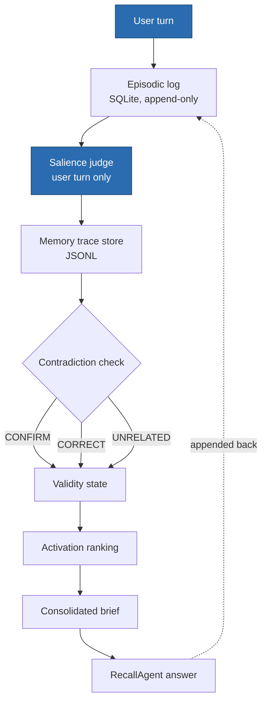
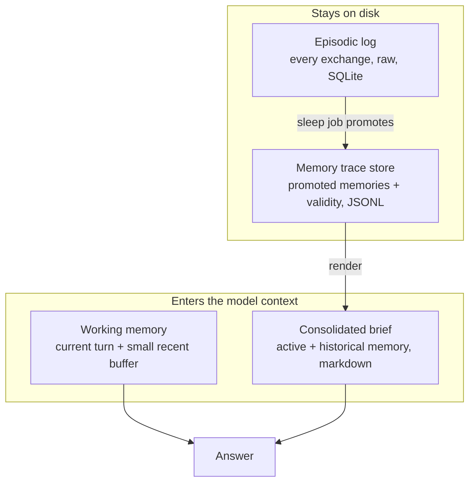
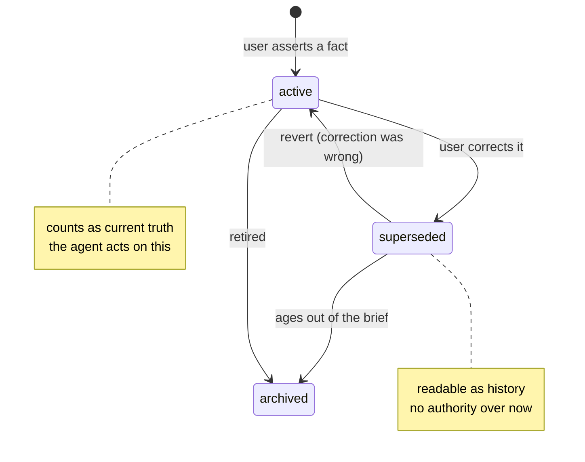
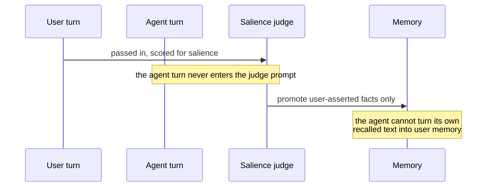
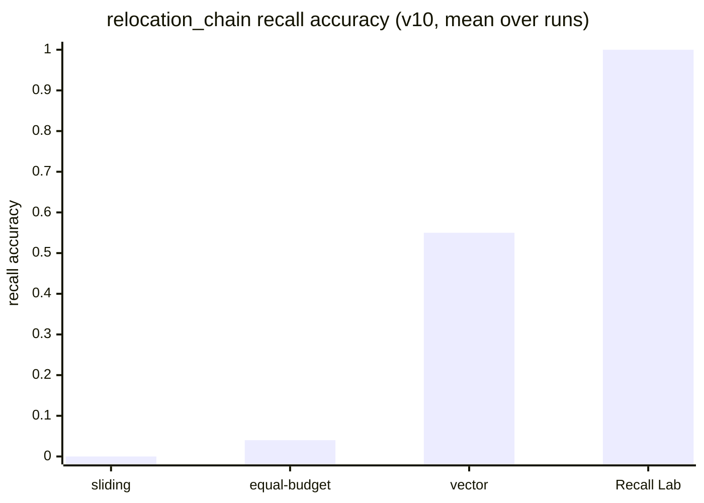

# Recall Lab diagrams

Diagrams as code. Each one maps to a part of the system so it cannot drift from
what the repo actually does. GitHub renders the Mermaid blocks inline.

## Visual vocabulary

Reused across every diagram so the series reads at a glance:

- **active / current truth** — green
- **superseded / past** — amber
- **archived / retired** — grey
- **the user as the only memory source** — blue
- arrows are flow; dashed arrows are write-back

---

## 1. The memory pipeline

One user turn, from raw exchange to answer. The sleep job runs steps 2 to 7
after each simulated day. Source: `recall_lab/consolidation/sleep.py`.

---

## 2. Memory layers

Four surfaces. Only working memory and the brief enter the model's context.
The episodic log and trace store stay on disk. Source: `recall_lab/memory/`.

---

## 3. Validity state machine

The heart of the thesis: forgetting removes authority, it does not erase
history. Maps one-to-one to `MemoryStatus` in `recall_lab/memory/traces.py`.

---

## 4. The source boundary

Why the salience judge sees only the user turn. Without this, the agent's own
recalled answer can re-enter memory as if the user just said it. The fix is
structural, not a prompt rule. Source: `recall_lab/consolidation/judge.py`.

---

## 5. v10 results on the relocation chain

Mean recall accuracy across runs, one synthetic scenario. The recency baselines
and flat vector retrieval fall short; the validity-aware system holds. Source:
`research-log.md` (May 29 entry) and `reports/variance/v10_*`.

Read: retrieval finds candidates, authority decides which one wins. The vector
control keeps facts that never changed but cannot order a chain of corrections.
Matching the recency baseline's token budget to Recall Lab's does not close the
gap, so the win is authority, not prompt length.
