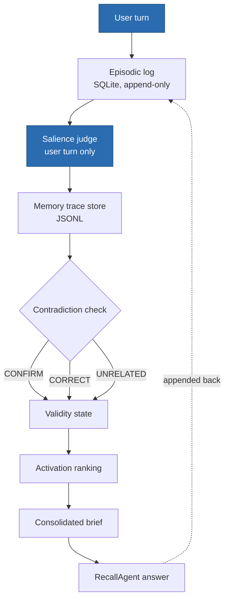
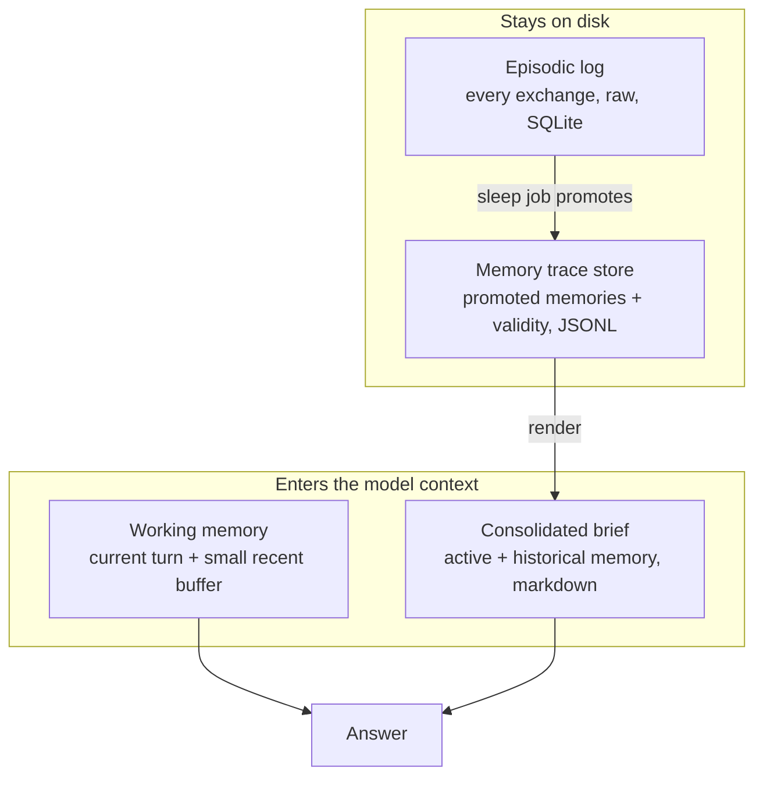
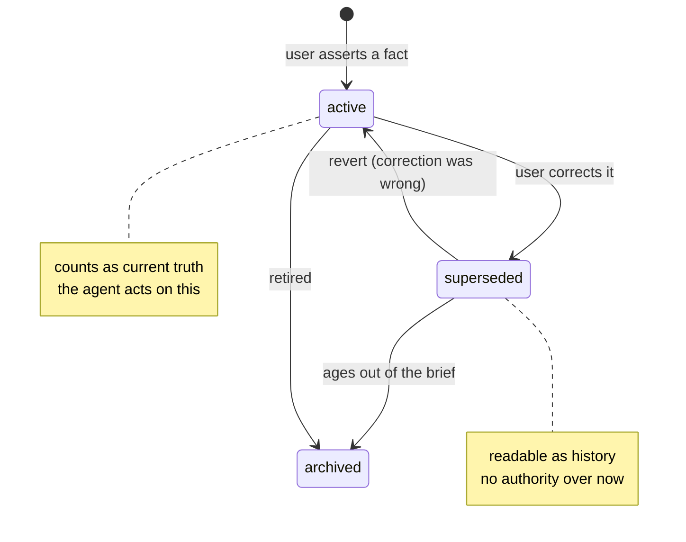
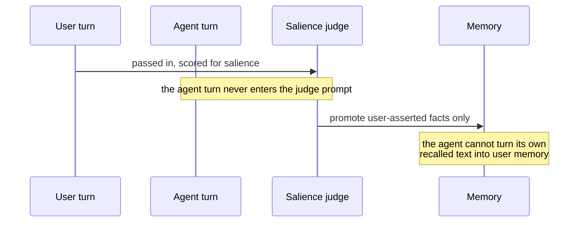
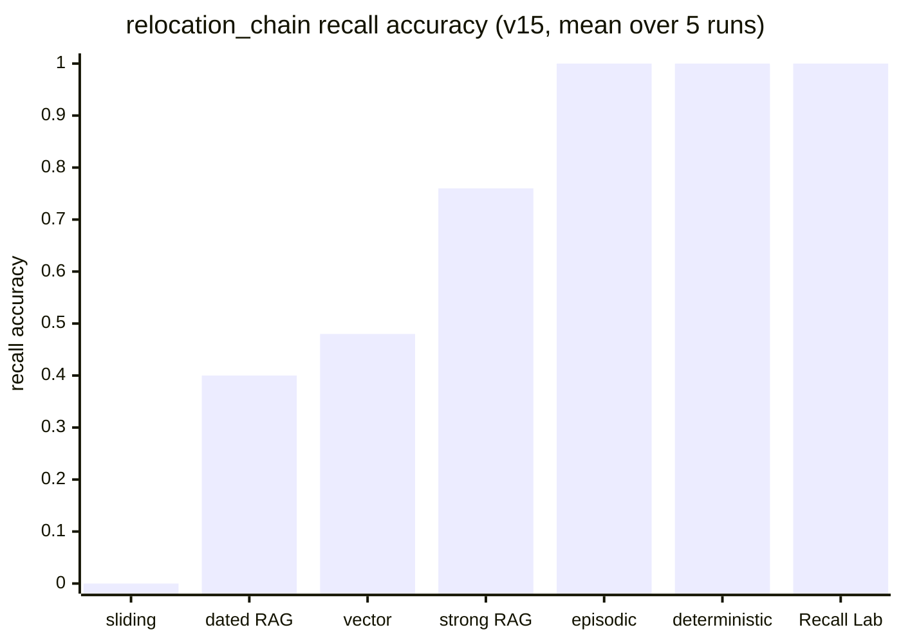
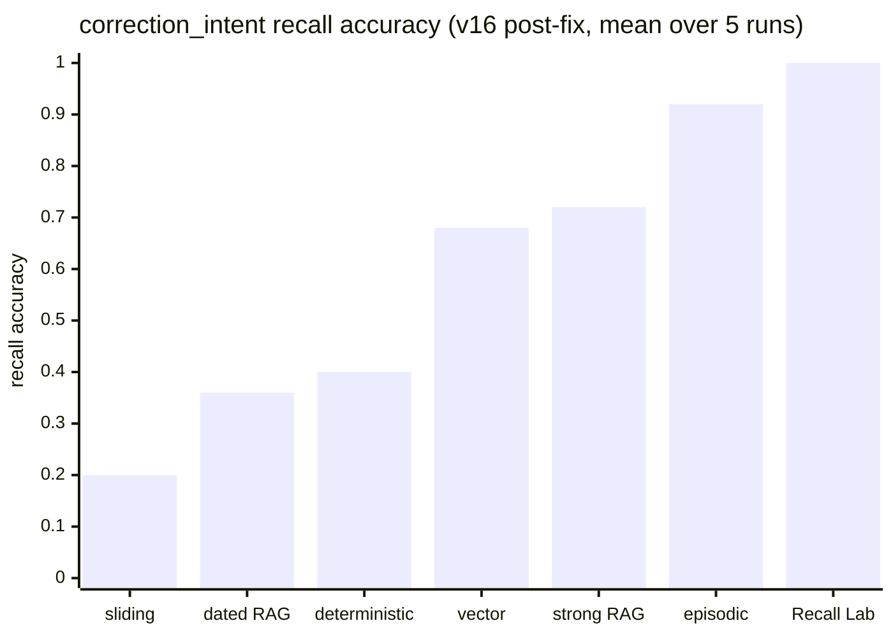

# Recall Lab diagrams

Diagrams as code. Each one maps to a part of the system so it cannot drift from
what the repo actually does. GitHub renders the Mermaid blocks inline.

## Visual vocabulary

Reused across every diagram so the series reads at a glance:

- **active / current truth** — green
- **superseded / past** — amber
- **archived / retired** — grey
- **the user as the only memory source** — blue
- arrows are flow; dashed arrows are write-back

---

## 1. The memory pipeline

One user turn, from raw exchange to answer. The sleep job runs steps 2 to 7
after each simulated day. Source: `recall_lab/consolidation/sleep.py`.

---

## 2. Memory layers

Four surfaces. Only working memory and the brief enter the model's context.
The episodic log and trace store stay on disk. Source: `recall_lab/memory/`.

---

## 3. Validity state machine

The heart of the thesis: forgetting removes authority, it does not erase
history. Maps one-to-one to `MemoryStatus` in `recall_lab/memory/traces.py`.

---

## 4. The source boundary

Why the salience judge sees only the user turn. Without this, the agent's own
recalled answer can re-enter memory as if the user just said it. The fix is
structural, not a prompt rule. Source: `recall_lab/consolidation/judge.py`.

---

## 5. Results: the two-scenario pair

The result is the pair of charts, not either one. Read together they say when
validity state is unnecessary and when it is decisive. Source: `research-log.md`
(June 16 and June 17 entries) and `reports/variance/v15_*`, `v16_*`.

### 5a. `relocation_chain` — every change is an explicit value-set

Five runs, pinned provider (v15).

Read: retrieval finds candidates, authority decides which one wins — every
retrieval baseline fails the oldest superseded fact. But the three rightmost bars
tie. A deterministic `max(timestamp)` sort matches the validity brief here,
because every correction in this scenario is an explicit user-stated value-set,
which is exactly the case where "take the latest" is correct by construction.
**This scenario does not justify validity state.** That is a falsification result,
and it is why the adversarial scenario exists.

### 5b. `correction_intent` — corrections that set no value

Five runs, pinned provider, post-fix (v16). Carries a revert (a change cancelled
without restating the prior value) and a stale re-assertion (a superseded value
fondly re-mentioned in passing).

Read: the timestamp sort that tied at 1.00 in 5a collapses to 0.40, and Recall Lab
is the only condition at 1.00. On the revert it scores 5/5 where deterministic and
all four retrieval controls score 0/5 and the raw episodic judge scores 3/5. Both
discriminators share one property — **the most recent mention of the attribute
sets no value** — which recency, timestamps and similarity are all blind to.

Caveat on 5b: `sliding_window_2` scores 0.20 rather than 0.00 only because a
two-turn window happens to span the relevant turn for the current-colour question.
That is a coverage artifact, not a finding.
